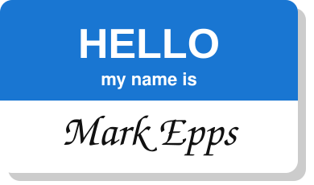

<p align="center">
  
</p>

<p align="center">
  <a href="https://markepps.com"></a>
  <a href="https://github.com/dillonzq/LoveIt"></a>
  <a href="LICENSE.md"></a>
  <a href="http://creativecommons.org/licenses/by-sa/4.0/"></a>
</p>

Source for [markepps.com](https://markepps.com) — a personal blog built with [Hugo](https://gohugo.io), the [LoveIt theme](https://github.com/dillonzq/LoveIt), and deployed via [Cloudflare Pages](https://pages.cloudflare.com/).

---

## Prerequisites

- [Hugo](https://gohugo.io/installation/) (extended version recommended)
- Git (with submodule support)

## Getting started

Clone the repo, initialising the theme submodule in one step:

```sh
git clone --recurse-submodules https://github.com/markymarkepps/markepps-com.git
cd markepps-com
```

If you already cloned without `--recurse-submodules`:

```sh
git submodule update --init --recursive
```

## Local development

```sh
hugo server -D
```

- `-D` includes draft posts
- Site is served at `http://localhost:1313` with live reload

## Content structure

```
content/
├── posts/       # Blog posts (Markdown, date-prefixed filenames)
├── projects/    # Portfolio / project pages
├── hobbies/     # Hobbies & interests
├── experience/  # Work history
└── contact/     # Contact page
```

New posts follow the `YYYY-MM-DD-post-title.md` naming convention. To create one using the archetype:

```sh
hugo new posts/YYYY-MM-DD-my-post-title.md
```

## Deployment

Deployments are handled automatically by Cloudflare Pages via [`build.sh`](build.sh):

| Branch    | Environment | URL                                  |
| --------- | ----------- | ------------------------------------ |
| `main`    | Production  | [markepps.com](https://markepps.com) |
| `staging` | Staging     | `staging.markepps-com.pages.dev`     |
| any other | Preview     | Auto-assigned Cloudflare preview URL |

The build command is `hugo --gc --minify` with the appropriate `-b` base URL per environment.

For a one-off local production build:

```sh
hugo --gc --minify
```

## Licence

Code is licensed under the [MIT Licence](LICENSE.md). Content (posts, pages) is licensed under [CC BY-SA 4.0](http://creativecommons.org/licenses/by-sa/4.0/).
